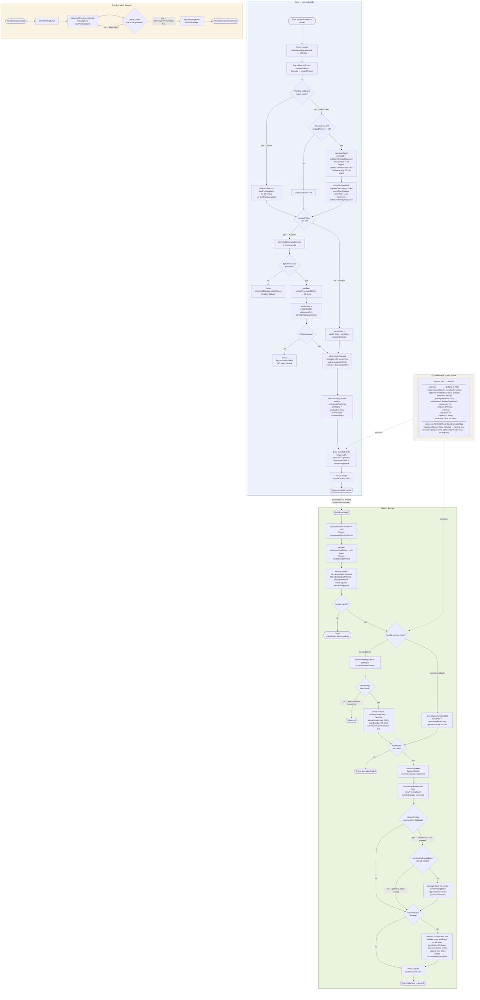

```mermaid
flowchart TD
    subgraph ALICE["Alice — encryptBundle"]
        A1([Start: encryptBundle for contact]) --> A2[Fetch contact\nValidate recipientMaterial == 65 bytes]
        A2 --> A3[Pop oldest blob from contactPrekeys\nDecode → contactPrekey]
        A3 --> A4{Pending outbound\nbatch exists?}

        A4 -- yes → reuse --> A5[outboundBatch = loadPendingBatch\nNo SE writes\nNo ownPrekeys update]

        A4 -- no → check need --> A6{SE stock low OR\ncontactPrekey == nil?}
        A6 -- no --> A7[outboundBatch = nil]
        A6 -- yes --> A8[generateBatch\ncontactID + outboundPrekeySequence\nPrivate keys in SE\ntagged prekey.contactID.seq.uuid\nThrows on any SE key failure]
        A8 --> A9[storePendingBatch\nappendOwnPrekeys blobs\npruneOwnPrekeys olderThan seq-1\nIncrement outboundPrekeySequence]

        A5 --> A10
        A7 --> A10
        A9 --> A10

        A10{contactPrekey\nnon-nil?} -- yes → FS path --> A11[generateEphemeralKeyPair\nin memory only]
        A11 --> A12{Ephemeral pair\ngenerated?}
        A12 -- no --> A13[Throw\nephemeralKeyGenerationFailed\nNO silent fallback]
        A12 -- yes --> A14[Validate contactPrekey.publicKey == 65 bytes]
        A14 --> A15[sessionKey =\nHKDF ECDH ephemeralPriv\ncontactPrekey.publicKey]
        A15 --> A16{ECDH success?}
        A16 -- no --> A17[Throw\nkeyDerivationFailed\nNO silent fallback]
        A16 -- yes --> A18[AES-256-GCM seal\nmessage with sessionKey\nauthenticating fullAAD\nversion + SecrecyContext]

        A10 -- nil → fallback --> A19[sessionKey =\nHKDF ECDH ourSEKey\nrecipientMaterial]
        A19 --> A18

        A18 --> A20[Build SecrecyContext\nmode + ephemeralPublicKey\nprekeyID + prekeySequence\nprekeyBatch outboundBatch]
        A20 --> A21[Build OccultaBundle\nversion v3fs\nsecrecy + ciphertext\nfingerprintNonce + senderFingerprint]
        A21 --> A22[Persist model\nmodelContext.save]
        A22 --> A23([Return encoded bundle])
    end

    subgraph BUNDLE["OccultaBundle — wire format"]
        B1["version: v3fs   ← in AAD
─────────────────────────────────
secrecy:             ← all fields in AAD
  mode: forwardSecret | longTermFallback
  ephemeralPublicKey: Data  65 bytes
  prekeyID: String?
  prekeySequence: Int?
  prekeyBatch: PrekeySyncBatch?
    sequence: Int
    prekeys: [Prekey]
      id: String
      sequence: Int
      contactID: String
      publicKey: Data  65 bytes
─────────────────────────────────
ciphertext: AES-GCM combined nonce‖ct‖tag
fingerprintNonce: Data  16 bytes  ← routing only
senderFingerprint: SHA-256(senderPub‖nonce) ← routing only"]
    end

    subgraph BOB["Bob — decrypt"]
        C1([Bundle received]) --> C2[Validate bundle.version == .v3fs\nThrows unsupportedBundleVersion]
        C2 --> C3[Validate ephemeralPublicKey == 65 bytes\nThrows invalidBundleFormat]
        C3 --> C4[Identify sender:\nfor each contact compute\nSHA-256 contactPubKey + fingerprintNonce\nmatch against senderFingerprint]
        C4 --> C5{Sender found?}
        C5 -- no --> C6([Throw noPublicKeyToEncryptWith])
        C5 -- yes --> C7{bundle.secrecy.mode?}

        C7 -- forwardSecret --> C8[findOwnPrekeyData by prekeyID\nin sender.ownPrekeys]
        C8 --> C9{Own prekey\nblob found?}
        C9 -- no → key missing or consumed --> C10([Return nil])
        C9 -- yes --> C11[Inside closure:\nretrievePrivateKey → SecKey\nderiveSessionKey ECDH\nopenBundle AES-GCM\nSecKey released at brace end]
        C11 --> C12{GCM open\nsuccess?}
        C12 -- no --> C13([Throw decryptionFailed])
        C12 -- yes --> C14[consume prekey\nSecItemDelete\nforward secrecy established]
        C14 --> C15[removeOwnPrekeyData blob\nclearPendingBatch\nproof of receipt confirmed]

        C7 -- longTermFallback --> C16[deriveSessionKey ECDH\nourSEKey + ephemeralPublicKey\nopenBundle AES-GCM]
        C16 --> C12

        C15 --> C17{inbound mode\nwas longTermFallback?}
        C17 -- no --> C19
        C17 -- yes → sender out of our prekeys --> C18{pendingOutboundBatch\nalready exists?}
        C18 -- yes → pending riding already --> C19
        C18 -- no --> C20[generateBatch for sender\nstorePendingBatch\nappendOwnPrekeys\npruneOwnPrekeys]
        C20 --> C19

        C19{inboundBatch\npresent?}
        C19 -- no --> C22
        C19 -- yes --> C21[Validate: count within limit\nValidate: each publicKey == 65 bytes\nsyncInboundPrekeys:\n  prune dead seq entries\n  append new blobs\n  update contactPrekeySequence]
        C21 --> C22[Persist model\nmodelContext.save]
        C22 --> C23([Return plaintext + ownerID])
    end

    subgraph PENDING["Pending batch lifecycle"]
        P1([New batch generated]) --> P2[storePendingBatch]
        P2 --> P3[Attached to every outbound\nmessage via loadPendingBatch]
        P3 --> P4{Contact uses\none of our prekeys?}
        P4 -- no → keep riding --> P3
        P4 -- yes → removeOwnPrekeyData fires --> P5[clearPendingBatch\nProof of receipt]
        P5 --> P6([Next replenishment allowed])
    end

    A23 -.->|transmitted via AirDrop\nemail iMessage etc| C1
    BUNDLE -.->|structure| A21
    BUNDLE -.->|structure| C7

    style ALICE   fill:#EDF2FA,stroke:#2E4A7A,color:#1B2A4A
    style BUNDLE  fill:#F1EFE8,stroke:#5F5E5A,color:#2C2C2A
    style BOB     fill:#EAF3DE,stroke:#3B6D11,color:#173404
    style PENDING fill:#FBF3E2,stroke:#8B6914,color:#3B2800
```
