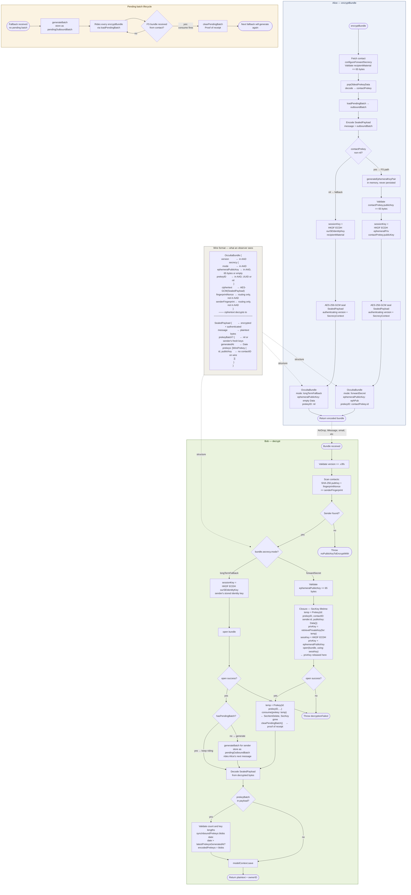

```mermaid
flowchart TD
    subgraph ALICE["Alice — encryptBundle"]
        A1([encryptBundle]) --> A2[Fetch contact\nconfigureForwardSecrecy\nValidate recipientMaterial == 65 bytes]
        A2 --> A3[popOldestPrekeyData\ndecode → contactPrekey]
        A3 --> A4[loadPendingBatch → outboundBatch]
        A4 --> A5[Encode SealedPayload\nmessage + outboundBatch]
        A5 --> A6{contactPrekey\nnon-nil?}

        A6 -- yes → FS path --> A7[generateEphemeralKeyPair\nin memory, never persisted]
        A7 --> A8[Validate contactPrekey.publicKey == 65 bytes]
        A8 --> A9[sessionKey =\nHKDF ECDH ephemeralPriv\ncontactPrekey.publicKey]
        A9 --> A10[AES-256-GCM seal SealedPayload\nauthenticating version + SecrecyContext]
        A10 --> A11[OccultaBundle\nmode: forwardSecret\nephemeralPublicKey: ephPub\nprekeyID: contactPrekey.id]

        A6 -- nil → fallback --> A12[sessionKey =\nHKDF ECDH ourSEIdentityKey\nrecipientMaterial]
        A12 --> A13[AES-256-GCM seal SealedPayload\nauthenticating version + SecrecyContext]
        A13 --> A14[OccultaBundle\nmode: longTermFallback\nephemeralPublicKey: empty Data\nprekeyID: nil]

        A11 --> A15([Return encoded bundle])
        A14 --> A15
    end

    subgraph BUNDLE["Wire format — what an observer sees"]
        B1["OccultaBundle {
  version           ← in AAD
  secrecy {
    mode            ← in AAD
    ephemeralPublicKey  ← in AAD, 65 bytes or empty
    prekeyID        ← in AAD, UUID or nil
  }
  ciphertext        ← AES-GCM(SealedPayload)
  fingerprintNonce  ← routing only, not in AAD
  senderFingerprint ← routing only, not in AAD
}

─── ciphertext decrypts to ───────────────────────

SealedPayload {         ← encrypted + authenticated
  message               ← plaintext bytes
  prekeyBatch? {        ← nil or sender's fresh keys
    generatedAt         ← Date
    prekeys: [WirePrekey {
      id, publicKey     ← no contactID on wire
    }]
  }
}"]
    end

    subgraph BOB["Bob — decrypt"]
        C1([Bundle received]) --> C2[Validate version == .v3fs]
        C2 --> C3[Scan contacts:\nSHA-256 pubKey + fingerprintNonce\n== senderFingerprint]
        C3 --> C4{Sender found?}
        C4 -- no --> C5([Throw noPublicKeyToEncryptWith])
        C4 -- yes --> C6{bundle.secrecy.mode?}

        C6 -- forwardSecret --> C7[Validate ephemeralPublicKey == 65 bytes]
        C7 --> C8["Closure — SecKey lifetime:
temp = Prekey(id: prekeyID, contactID: sender.id, publicKey: Data())
privKey = retrievePrivateKey(for: temp)
sessKey = HKDF ECDH privKey + ephemeralPublicKey
open(bundle, using: sessKey)
← privKey released here"]
        C8 --> C9{open success?}
        C9 -- no --> C10([Throw decryptionFailed])
        C9 -- yes --> C11["temp = Prekey(id: prekeyID, ...)
consume(prekey: temp)   ← SecItemDelete, SecKey gone
clearPendingBatch()     ← proof of receipt"]

        C6 -- longTermFallback --> C12[sessionKey =\nHKDF ECDH ourSEIdentityKey\nsender's stored identity key]
        C12 --> C13[open bundle]
        C13 --> C14{open success?}
        C14 -- no --> C10
        C14 -- yes --> C15{hasPendingBatch?}
        C15 -- no → generate --> C16[generateBatch for sender\nstore as pendingOutboundBatch\nrides Alice's next message]
        C15 -- yes → keep riding --> C17

        C11 --> C17[Decode SealedPayload\nfrom decrypted bytes]
        C16 --> C17
        C17 --> C18{prekeyBatch\nin payload?}
        C18 -- no --> C20
        C18 -- yes --> C19[Validate count and key lengths\nsyncInboundPrekeys blobs date:\ndate > latestPrekeysGeneratedAt?\nencodedPrekeys = blobs]
        C19 --> C20[modelContext.save]
        C20 --> C21([Return plaintext + ownerID])
    end

    subgraph PENDING["Pending batch lifecycle"]
        P1([Fallback received\nno pending batch]) --> P2[generateBatch\nstore as pendingOutboundBatch]
        P2 --> P3[Rides every encryptBundle\nvia loadPendingBatch]
        P3 --> P4{FS bundle received\nfrom contact?}
        P4 -- no --> P3
        P4 -- yes:\nconsume fires --> P5[clearPendingBatch\nProof of receipt]
        P5 --> P6([Next fallback will generate again])
    end

    A15 -.->|AirDrop, iMessage, email, etc| C1
    BUNDLE -.->|structure| A11
    BUNDLE -.->|structure| A14
    BUNDLE -.->|structure| C6

    style ALICE   fill:#EDF2FA,stroke:#2E4A7A,color:#1B2A4A
    style BUNDLE  fill:#F1EFE8,stroke:#5F5E5A,color:#2C2C2A
    style BOB     fill:#EAF3DE,stroke:#3B6D11,color:#173404
    style PENDING fill:#FBF3E2,stroke:#8B6914,color:#3B2800
```
