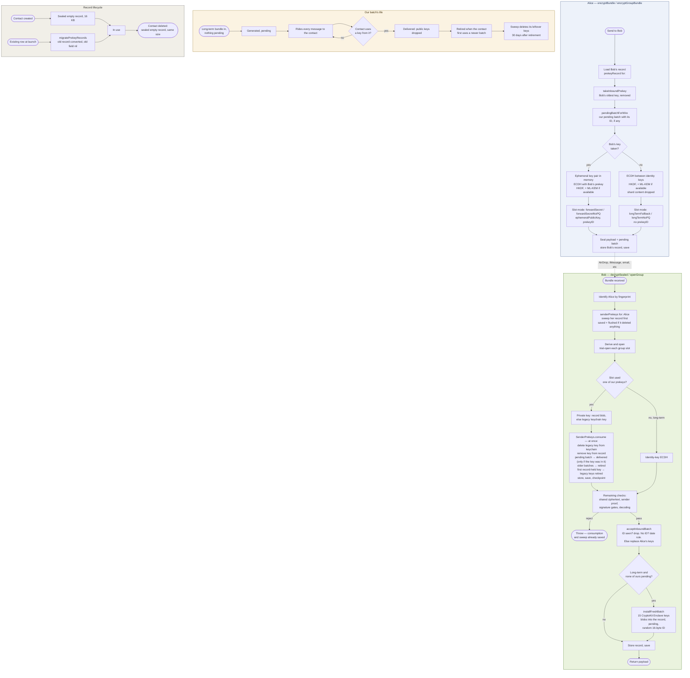

Prekey flow as of prekey continuity stage 1. The prose, with the reasons, is `FORWARD_SECRECY_GUIDE.md`.

```mermaid
flowchart TD
    subgraph ALICE["Alice — encryptBundle / encryptGroupBundle"]
        A1([Send to Bob]) --> A2[Load Bob's record\nprekeyRecord for:]
        A2 --> A3[takeInboundPrekey\nBob's oldest key, removed]
        A3 --> A4[pendingBatchForWire\nour pending batch with its ID, if any]
        A4 --> A6{Bob's key\ntaken?}

        A6 -- yes --> A7[Ephemeral key pair in memory\nECDH with Bob's prekey\nHKDF, + ML-KEM if available]
        A7 --> A11[Slot mode: forwardSecret / forwardSecretNoPQ\nephemeralPublicKey, prekeyID]

        A6 -- no --> A12[ECDH between identity keys\nHKDF, + ML-KEM if available\nshard content dropped]
        A12 --> A14[Slot mode: longTermFallback / longTermNoPQ\nno prekeyID]

        A11 --> A15[Seal payload + pending batch\nstore Bob's record, save]
        A14 --> A15
    end

    subgraph BOB["Bob — decryptSealed / openGroup"]
        C1([Bundle received]) --> C2[Identify Alice by fingerprint]
        C2 --> C3[senderPrekeys for: Alice\nsweep her record first\nsaved + flushed if it deleted anything]
        C3 --> C4[Derive and open\ntrial-open each group slot]
        C4 --> C5{Slot used\none of our prekeys?}

        C5 -- yes --> C6[Private key: record blob,\nelse legacy keychain key]
        C6 --> C7["SenderPrekeys.consume — at once:
delete legacy key from keychain
remove key from record
pending batch → delivered (only if the key was in it)
older batches → retired
first record-held key → legacy keys retired
store, save, checkpoint"]

        C5 -- no, long-term --> C8[Identity-key ECDH]

        C7 --> C9[Remaining checks:\nshared ciphertext, sender proof,\nsignature gates, decoding]
        C8 --> C9
        C9 -- reject --> C10([Throw — consumption\nand sweep already saved])
        C9 -- pass --> C11[acceptInboundBatch\nID seen? drop. No ID? date rule.\nElse replace Alice's keys]
        C11 --> C12{Long-term and\nnone of ours pending?}
        C12 -- yes --> C13[installFreshBatch\n15 CryptoKit Enclave keys\nblobs into the record, pending,\nrandom 16-byte ID]
        C12 -- no --> C14
        C13 --> C14[Store record, save]
        C14 --> C15([Return payload])
    end

    subgraph LIFE["Our batch's life"]
        P1([Long-term bundle in,\nnothing pending]) --> P2[Generated, pending]
        P2 --> P3[Rides every message to the contact]
        P3 --> P4{Contact uses\na key from it?}
        P4 -- no --> P3
        P4 -- yes --> P5[Delivered: public keys dropped]
        P5 --> P6[Retired when the contact\nfirst uses a newer batch]
        P6 --> P7[Sweep deletes its leftover keys\n30 days after retirement]
    end

    subgraph RECORD["Record lifecycle"]
        R1([Contact created]) --> R2[Sealed empty record, 16 KB]
        R0([Existing row at launch]) --> R3[migratePrekeyRecords\nold record converted, old field nil]
        R2 --> R4[In use]
        R3 --> R4
        R4 --> R5([Contact deleted:\nsealed empty record, same size])
    end

    A15 -.->|AirDrop, iMessage, email, etc| C1

    style ALICE  fill:#EDF2FA,stroke:#2E4A7A,color:#1B2A4A
    style BOB    fill:#EAF3DE,stroke:#3B6D11,color:#173404
    style LIFE   fill:#FBF3E2,stroke:#8B6914,color:#3B2800
    style RECORD fill:#F1EFE8,stroke:#5F5E5A,color:#2C2C2A
```
