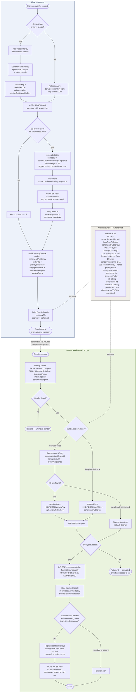

```mermaid
flowchart TD
    subgraph ALICE["Alice — encrypt"]
        A1([Start: encrypt for contact]) --> A2{Contact has\nprekeys stored?}

        A2 -- yes --> A3[Pop oldest Prekey\nfrom contact's store]
        A2 -- no --> A4[Fallback path:\nderive session key from\nlong-term ECDH]

        A3 --> A5[Generate throwaway\nephemeral key pair\nin memory only]
        A5 --> A6[sessionKey =\nHKDF ECDH ephemeralPriv\ncontactPrekey.publicKey]
        A6 --> A7[AES-256-GCM seal\nmessage with sessionKey]
        A4 --> A7

        A7 --> A8{SE prekey stock\nfor this contact low?}
        A8 -- yes --> A9[generateBatch\ncontactID + contact.outboundPrekeySequence\nPrivate keys in SE\ntagged prekey.contactID.seq.uuid]
        A8 -- no --> A10[outboundBatch = nil]
        A9 --> A11[Increment\ncontact.outboundPrekeySequence]
        A11 --> A12[Prune SE keys\nfor this contact\nsequences older than seq-1]
        A12 --> A13[Wrap batch in\nPrekeySyncBatch\nsequence + prekeys]
        A10 --> A14
        A13 --> A14[Build SecrecyContext\nmode + ephemeralPublicKey\nprekeyID + prekeySequence\nfingerprintNonce + senderFingerprint\nprekeyBatch]
        A14 --> A15[Build OccultaBundle\nversion v3fs\nsecrecy + ciphertext]
        A15 --> A16([Bundle ready\nshare via any transport])
    end

    subgraph BUNDLE["OccultaBundle — wire format"]
        B1["version: v3fs
secrecy:
  mode: forwardSecret | longTermFallback
  ephemeralPublicKey: Data  65 bytes
  prekeyID: String?
  prekeySequence: Int?
  fingerprintNonce: Data  16 bytes
  senderFingerprint: SHA-256 senderPubKey + nonce
  prekeyBatch: PrekeySyncBatch?
    sequence: Int
    prekeys: Prekey
      id: String
      sequence: Int
      contactID: String
      publicKey: Data
ciphertext: AES-GCM combined"]
    end

    subgraph BOB["Bob — receive and decrypt"]
        C1([Bundle received]) --> C2[Identify sender:\nfor each contact compute\nSHA-256 contactPubKey + fingerprintNonce\nmatch against senderFingerprint]
        C2 --> C3{Sender found?}
        C3 -- no --> C4([Discard — unknown sender])
        C3 -- yes --> C5{bundle.secrecy.mode?}

        C5 -- forwardSecret --> C6[Reconstruct SE tag\nprekey.contactID.seq.id\nfrom prekeyID + prekeySequence]
        C6 --> C7{SE key found?}
        C7 -- yes --> C8[sessionKey =\nHKDF ECDH prekeyPriv\nephemeralPublicKey]
        C8 --> C9[AES-256-GCM open]
        C9 --> C10{Decrypt success?}
        C10 -- yes --> C11[DELETE prekey private key\nfrom SE immediately\nFORWARD SECRECY ESTABLISHED]
        C10 -- no --> C12([Return nil — corrupted\nor not addressed to us])
        C7 -- no, already consumed --> C13[Attempt long-term\nfallback decrypt]
        C13 --> C10

        C5 -- longTermFallback --> C14[sessionKey =\nHKDF ECDH ourSEKey\nephemeralPublicKey]
        C14 --> C9

        C11 --> C15[Store plaintext locally\nin SwiftData immediately\nBundle is now disposable]
        C15 --> C16{inboundBatch present\nand sequence greater\nthan stored sequence?}
        C16 -- yes --> C17[Replace contactPrekeys\nentirely with new batch\nUpdate contactPrekeySequence]
        C17 --> C18[Prune our SE keys\nfor sender contact\nsequences older than old seq]
        C16 -- no, stale or absent --> C19[Ignore batch]
        C18 --> C20([Done])
        C19 --> C20
    end

    A16 -.->|transmitted via AirDrop\nemail iMessage etc| C1
    BUNDLE -.->|structure| A15
    BUNDLE -.->|structure| C5

    style ALICE fill:#EDF2FA,stroke:#2E4A7A,color:#1B2A4A
    style BUNDLE fill:#F1EFE8,stroke:#5F5E5A,color:#2C2C2A
    style BOB fill:#EAF3DE,stroke:#3B6D11,color:#173404
```
